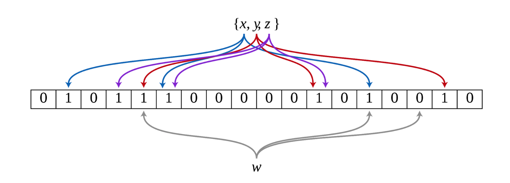

# Bloom Filter

> bloom filter는 원소가 집합에 속하는지 여부를 검사하는데 사용되는 확률적 자료구조 이다. 적은 저장공간을 사용할 수 있다. 
>
> bloom filter에 의해 어떤 원소가 집합에 속한다고 판단된 경우 실제로는 원소가 집합에 속하지 않는 *긍정 오류* 가 발생하는 것이 가능하지만, 반대로 원소가 집합에 속하지 않는 것으로 판단되었는데 실제로는 원소가 집합에 속하는 *부정 오류* 는 절대로 발생하지 않는다는 특성이 있다



## 구조

> 블룸 필터는 `m `비트 크기의 비트 배열 구조를 가진다. 또한 블룸 필터에서는 `k `가지의 서로 다른 hash function을 사용하며, 각 해시 함수는 입력된 원소에 대해 `n` 가지의 값을 균등확률로 출력해야 한다.
>
> 블룸 필터는 집합에 원소를 추가하는 명령어와 원소가 속하는지를 검사하는 명령어를 지원한다. (원소를 삭제하는 명령어는 존재하지 않는다.)
>
> - 원소를 추가하는 경우, 추가하려는 원소에 대해 `k` 가지의 해시 값을 계산한 다음, 각 해시 값에 대응하는 비트를 1로 설정한다.
> - 원소를 검사하는 경우, 해당 원소에 대해 `k` 가지의 해시 값을 계산한 다음, 각 해시 값에 대응하는 비트값을 읽는다. 모든 비트가 1인 경우 속한다고 판단하며, 나머지는 속하지 않는다고 판단한다.


## 성질

> 블룸 필터의 원소 추가와 원소 검사에 걸리는 시간은 O(k)으로, 집합에 **포함되어 있는 원소 수와 무관**하다.


## 구현

```javascript
const _BloomFilter = (function(){
	function BloomFilter(){
		this.limit = 18;
		this._storage = LimitedStorage(this._limit);
		this.timeComplex = 0;
	}

	BloomFilter.prototype.encoding = function(key){

		const newNode = new Node(key);
		const index = [];

		index.push( firstHashFunction(key, this.limit) );
		index.push( secondHashFunction(key, this.limit) );
		index.push( thirdHashFunction(key, this.limit) );

		index.forEach((ele) => { this._storage.set(ele, 1) });
	}

	BloomFilter.prototype.decoding = function(key){
		this.timeComplex = 0;
		
		let result = [];
		const index = [];
		index.push( firstHashFunction(key, this.limit) );
		index.push( secondHashFunction(key, this.limit) );
		index.push( thirdHashFunction(key, this.limit) );

		result = index.map( (ele) => {
			const firstNode = this._storage.get(ele);
			this.timeComplex++;
			return firstNode === 1 ? true : false;
		}).every((ele) => ele);		

		return result;
	}

	return BloomFilter;
})();

const Node = function(key){
	this._key = key;
	this._next = null;
}


function LimitedStorage(limit) {
  const storage = [];

  const limitedStorage = {};
  limitedStorage.get = function (index) {
    return storage[index];
  };
  limitedStorage.set = function (index, value) {
    storage[index] = value;
  };

  return limitedStorage;
};


function firstHashFunction(key, limit){
    /... hash function .../
	return hash % limit;
}

function secondHashFunction(key, limit){
	/... hash function .../
	return hash % limit;
}

function thirdHashFunction(key, limit){
	/... hash function .../
	return hash % limit;
}

if (typeof module === "object" && typeof module.exports === "object") {
  module.exports = _BloomFilter;
}
```

