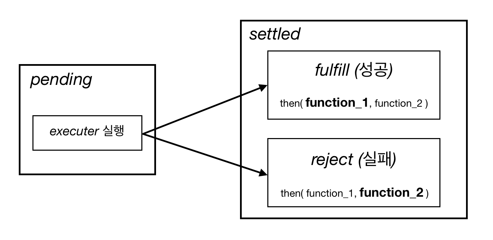

# Promise

> Promise 는 비동기처리를 위한 메커니즘을 제공한다.(기본적으로 자바스크립트는 동기로 실행된다.) 코드 구현 관점에서 보면 Promise는 하나의 오브젝트이다.

```javascript
function create(){
    return new Promise(function(resolve, reject){
        resolve(); //함수를 호출하는 형태이지만, 실제로 이때 호출하진 않는다.
        console.log("1 : resolve call");
    });
}

create().then(function(){
    console.log("3 : success");
}, function(){
    console.log("3 : false");
});

console.log("2 : end");

//실행순서
"1 : resolve call"
"2 : end"
"3 : success"
```

- Promise객체의 생성자에 argument로 넘긴 함수를 `executor` 라고 한다.

- Promise객체가 생성될 때, executor가 실행된다.


### Promise 상태

> Promise는 실행할 때마다 진행 상태를 `promiseState`에 저장한다. 코드를 연속적으로 실행하지 않으므로 진행 상태의 저장이 필요하다. Promise의 진행상태는 크게 `pending` 과 `settled`로 나눌 수 있다.
>
> 그리고 `settled` 상태는 다시 `성공(fulfill)` 과 `실패(reject)`로 나눌 수 있다.
>
> 성공시 then함수로 넘겨진 첫번째 argument function이 실행되고, 실패시 두번째 argument function이 실행된다.



- promise 인스턴스가 생성되어 반환되면, resolve()를 then의 첫번째 파라미터 함수에 바인딩 하고, reject()를 then의 두번째 파라미터 함수에 바인딩한다.