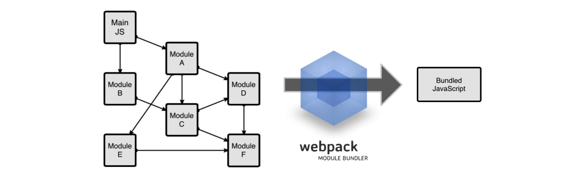

# Modularization & Bundling

### JS Module

> 웹 개발에서 javascript 코드량이 많아지면서 코드의 유지와 보수가 쉽도록 코드를 모듈로 나누어 관리해야 할 필요가있다. 또한 JavaScript를 웹 스크립트언어라는 한계를 넘어 범용적 사용 ( 서버와 같은 웹 스크립트 이외의 부분에서도 사용가능하도록) 을 위해서도 모듈화는 꼭 필요한 부분이다. 
>
> Javascript 모듈화 명세를 만든 대표적인 그룹이 CommonJS이다. 현재 node표준으로 자리하고 있다. 
>
> 이후 ES6로 넘어오면서 ES6 Module (import/ export) 이라는 이름으로 JavaScript내부 모듈시스템을 지원하기 시작했다.

 ```html
 <!DOCTYPE html>
 ...
 <body>
   <script src='./display.js'></script>
   <script src='./get.js'></script> 
   <script src='./display.js'></script>
 </body>
 
 //위 코드처럼 기존의 스크립트 파일을 분리해서 작성할 수 있지만 여러가지 문제점이 있다.
 //가장 큰 문제는 스코프 이슈, 중복변수 이슈, 의존성 이슈(코드선언 순서)등이 있다.
 ```

### Bundler

> 모듈화를 할 수록 파일의 수는 많아질 수 밖에 없다. 파일이 많아지면 유저에게 전달할 파일이 많아진다. 예를 들어, 어떤 웹 페이지를 로드하기 위해 html 파일 1개, js파일 5개가 필요하다고 하면 총 6개의 파일을 받아야 한다. 파일이 많아질수록 네트워크 비용이 증가하는 이슈가 발생한다. 이러한 이슈를 
>
> bundler를 통해 해결할 수 있다. bundler는 동일한 파일을 하나로 묶어 하나의 번들파일로 만들어준다. 하나의 파일만 로드하면 되므로 네이워크 비용을 상당히 줄일 수 있다.


