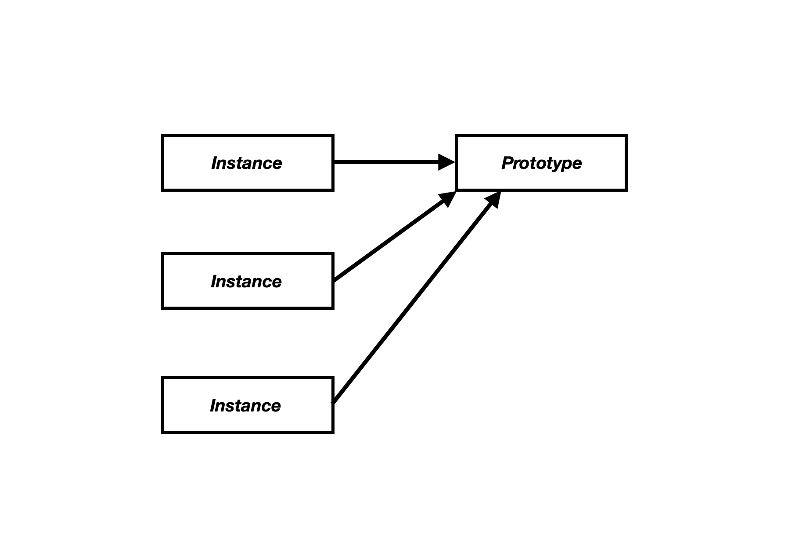
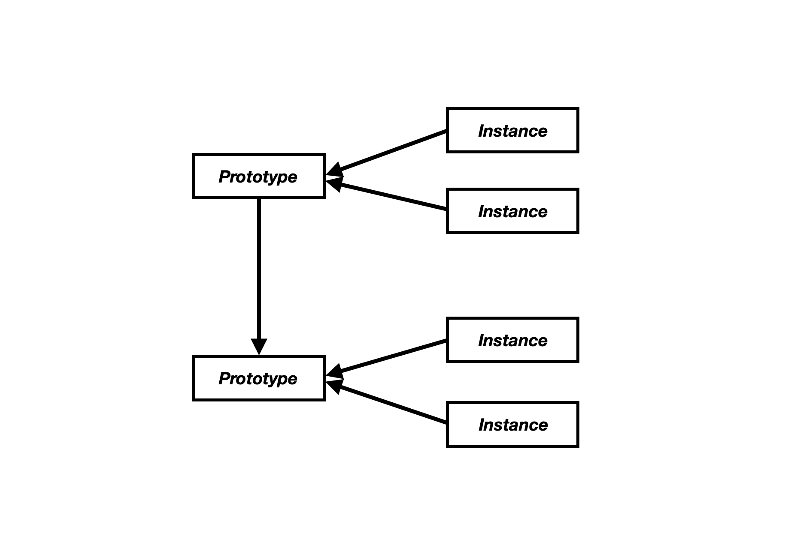

# Prototype

>프로토타입이란 인스턴스가 생성(instantiation)될 때 원형(original form)으로 프로토타입의 모양대로 인스턴스가 생성된다. 같은 생성자를 통해 만들어진 객체들은 모두 이 프로토타입을 공유한다. 즉, 객체를 만들때마다 prototype의 속성이 그대로 다 넘어오는 것이 아니라 한번 만들어진 prototype에 연결만 된다.



### Prototype Chain

---

> 프로토타입 체인을 통해 상속을 구현할 수 있다. 각각의 생성자로 만들어진 인스턴스는 각 생성자에 해당하는 프로토타입을 참조한다.



### Instantiation Patterns

---

**Prototypal vs PseudoClassical**

두 방법 모두 생성자 함수라고 불리는 함수를 이용해서 인스턴스를 생성한다.

```js
//Prototypal

const someMethod = {
  add: function(){
    this.name += '!!!'
  }
};

//생성자 함수
function Person(name){
  const newInstance = Object.create(someMethod);
  newInstance.name = name;
  
  return newInstance;
}

let person_1 = Person('walli');
let person_2 = Person('park');
```

```js
//PseudoClassical

//생성자 함수
function Person(name){
  this.name = name;
}

Person.prototype.add = function(){
  this.name += "!!!"
}

let person_1 = new Person('walli');
let person_2 = new Person('park');
```


- 같은 함수 호출이지만  **new 키워드를 쓸 경우 객체를 만들어 준다.**  함수 실행은 두 방법 모두 정확히 동일하게 일어나고, new 키워드를 사용 할 경우 부수적으로 객체가 만들어진다. ( 생성자 함수를 new를 이용해 호출할수도 있고, 일반함수로 호출할 수도 있다. )

- Prototypal의 경우 생성자 함수 내부에서 객체를 직접 만들어 반환해야 하지만, Pseudoclassical의 경우 new 키워드를 통해 만들 수 있다.

- 기타 비동기 처리에 대한 자료를 좀더 정리하자...
