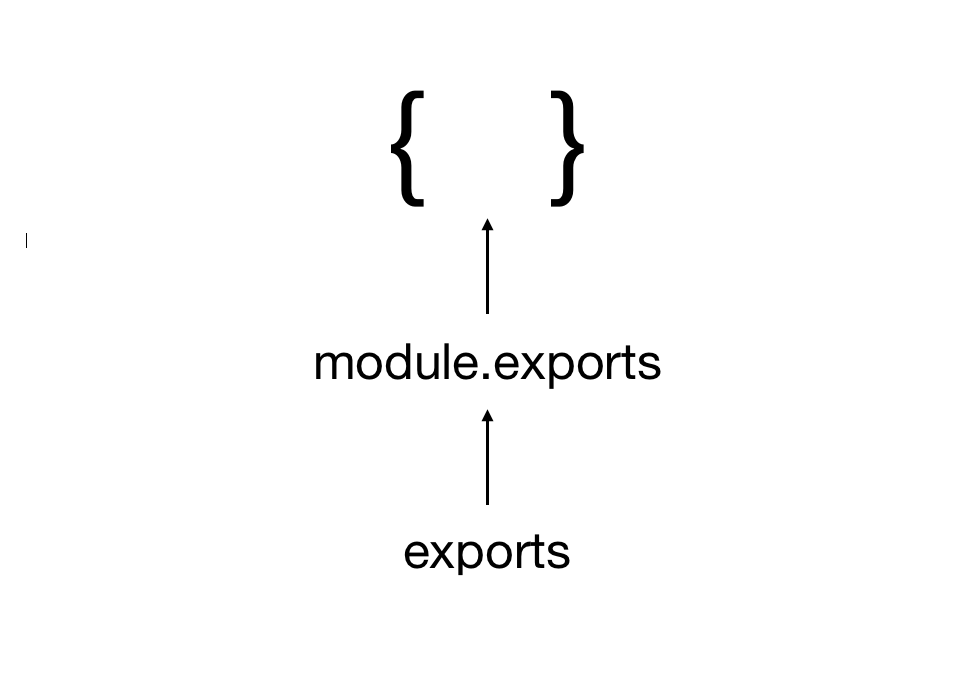

# exports *vs* module.exports

### Common Js

> 범용적인 목적으로 JS를 사용하기 위해 필요한 조건은 **모듈화** 이다. JS의 모듈화 작업의 선두 주자가 common JS 이다.
>
> common JS의 주요 명세는 바로 이 모듈을 어떻게 정의하고, 어떻게 사용할 것인가에 대한 것이다.


### Module

> 모듈화는 다음과 같은 세 부분으로 이루어 진다.
>
> - ***Scope*** : 모든 모듈은 자신만의 독립적인 실행 영역이 있어야 한다.
> - ***Definition*** : 모듈 정의는 **exports** 객체를 이용한다.
> - ***Usage*** : 모듈 사용은 **require** 함수를 이용한다.
>
> 기본적으로 module.exports와 exports 모두 하나의 객체를 바라보고 있는데, **최종적으로 return 되는 것은 무조건 module.exports이다.**
>
> require() 함수는 module.exports를 리턴한다. 
>
> requrie 함수를 실행시키면 불러오려고 하는 파일을 한번 실행시킨다. 하지만 같은 파일에서 require를 이용해 같은 파일을 두번 이상 호출할 경우 처음 한번만 실행된다.



```js
var module = {
  exports: {}
};
var exports = module.exports;
return module.exports;
```

