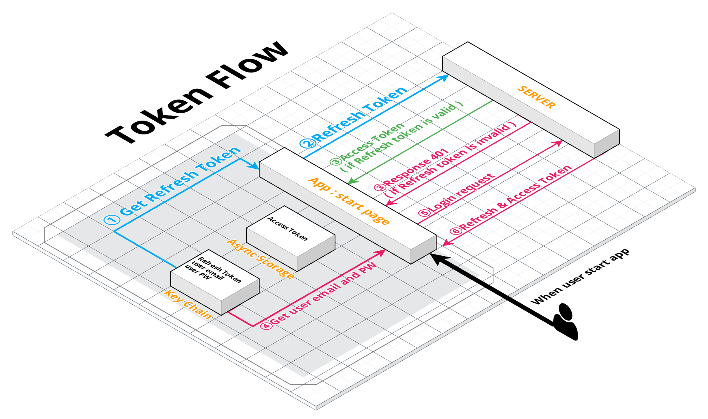

# JWT Authenication

사용자 인증을 위해 JWT를 적용해 보았다. 토큰 방식 인증은 간편하게 사용할 수 있지만, 보안에 대한 부분이 계속 마음에 걸렸다. 토큰을 어디에 저장 해야 할지부터 토큰이 만료된다면 어떻게 재발급 할 것인가에 대한 부분등 여러가지 이슈가 있었다.

고민끝에 아래와 같은 플로우로 토큰을 사용하기로 했다.

1. 유저가 최초 회원가입을 하면 서버는 유저에게 Refresh token 과 Access toekn을 발급해준다.

2. Refresh token은 안전한 저장소에 저장되고, Access토큰은 Async storage에 저장된다. 

   두 토큰은 만료 기간이 다른데, Refresh token의 만료 기간은 길게, Access token의 만료기간은 짧게 설정한다. 이렇게 하는 이유는 앱내에서 시행되는 모든 요청은 Access token을 이용하게 되는데, 혹시 token이 누출되더라도 짧은 만료기간을 이용해 무력화 시키기 위함이다.

   Access token이 만료되면 Refresh token을 서버에 보내 Access token을 재발급 받는다.

3. 회원가입 이후에는, 사용자가 앱을 실행시키는 시점에서 항상 서버에게 Refresh token을 보내 Access token을 갱신한다. 이렇게 하는 이유는 사용자가 앱을 사용하는동안에 토큰이 만료됨을 방지하기 위함이다. Access token의 만료시간은 2시간으로 설정했다.

4. 사용자가 앱을 실행시켰을 때 Refresh token이 만료되었다면, 안전한 저장소에 저장해두었던 사용자 정보를 가져와 로그인 요청을 보낸다.( 이때는 사용자가 로그인을 하는게 아니라 자동으로 처리된다. ) 

5. 로그인 요청에 응답으로 Refresh token과 Access token이 사용자에게 오게된다. 이렇게 함으로써 사용자가 로그아웃을 하지 않는다면 로그인 상태를 유지된다.