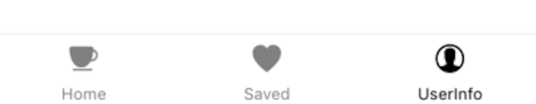

# Navigation

> 네비게이션은 react-router와 비슷한 기능이다. 모바일 환경에 맞게 스크린을 이동(컴포넌트를 변경) 시켜주고, 모바일에서 많이 사용되는 스택 구조, 탭 구조 등 과 같은 구성을 쉽게 할 수 있도록 도와주는 역할을 한다.
>
> 리액트 네이티브에서 네비게이션의 선택지는 다양하다. 무엇을 선택하던지 비슷한 기능을 하기 때문에 사람들이 많이 사용하는 네비게이션중 하나를 선택한다면 사용하는데 큰 어려움은 없다.
>
> react-navigation 과 react-native-navigation 을 모두 사용해 보았지만 여기서는 react-navigation에 대해서만 이야기 한다.


### 1. Install

```
$ npm install --save react-navigation
$ npm install --save react-native-gesture-handler

$ react-native link react-native-gesture-handler
```


### 2. Basic flow

```js
const AppNavigator = createStackNavigator(
  {
    Welcome: {
      screen: Welcome,
      navigationOptions: {
        header: null,
      },
    },

    SignUp: {
      screen: SignUp,
      navigationOptions: {
        headerStyle: {
          borderBottomWidth: 0,
        },
      },
    },
	//... any screen component ... 
  },
  {
    //first view component(screen)
    initialRouteName: 'Welcome',
  },
);

const AppContainer = createAppContainer(AppNavigator);

AppRegistry.registerComponent( <Project_name>, () => AppContainer);
```

Navigation으로 연결하고 싶은 컴포넌트는 모두 여기에 등록하면, 등록한 컴포넌트끼리 자유롭게 이동이 가능하다. 

```js
this.props.navigation.navigate(<screen_name>);
```

심지어 인자를 같이 넘길 수도 있어서 마치 반쪽짜리 리덕스를 쓰는 느낌이 들기도 한다.

```js
this.props.navigation.navigate(<screen_name>, {name: 'walli'});
```

이동 뿐만 아니라 스택처럼 쌓을 수 도 있고, 같은 레벨에서 탭으로 연결해서 이동할 수 도 있다.




> https://reactnavigation.org/en/

