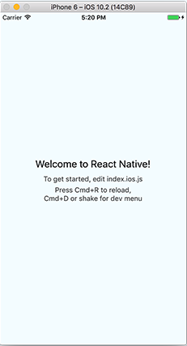

# Start React Native

> 리액트 네이티브는 한마디로 리액트의 모바일 확장 버전이다. 네이티브의 높은 진입장벽에 자바스크립트라는 에스컬레이터를 설치한 모습이다. js 하나만으로 안드로이드와 ios 플랫폼 두가지를 한번에 작성할 수 있다는 큰 장점을 가지고 있다. 또한 다양한 라이브러리를 제공하고 있어서 네이티브 만큼이나 다양한 퍼포먼스를 낼 수 있다.

### 1. Start

```
$ brew install watchman
```

```
$ npm install -g react-native-cli
```

- 위 두가지 커맨드로 react-native를 시작할 준비는 끝이다. ( Node.js는 기본 )


```
$ react-native init <project_name>
```

```
$ cd <project_name>
$ react-native run-ios
```



위와 같은 화면이 보여진다면 기본적인 셋팅은 끝이다. 이 후 부터는 컴포넌트를 작성하면 된다. 계속 react-native-cli를 사용해도 되지만 XCode를 사용해서 실행하도록 하자. ios 개발과정에서 리액트 네이티브를 사용하더라도 계속해서 XCode를 만져야 하기 때문에 (라이브러리를 추가하거나, 빌드 셋팅을 할 때...) 익숙해지는게 좋겠다.


### 2. install Cocoapods

> CocoaPods 는 Xcode dependency manager 이다. npm 과 같은 역할을 하는 녀석이다. npm 을 사용할 때 `package.json` 파일을 만들어 사용하는 것 처럼, Cocoapods을 사용할 땐 `Podfile` 파일을 만들어 사용한다. `Podfile` 안에는 설치할 라이브러리와 버전등을 기입하고 `pod install` 을 통해 설치한다.
>
> cocoapods를 이용하면 편리하게 종속 라이브러리 버전을 관리할 수 있다.

```
//ios 디랙토리에서 실행한다.
$ gem install cocoapods
$ vi Podfile
```

```
$ pod install
```

pod를 이용하면 여러가지를 편하게 셋팅할 수 있지만 조심해야할 부분이 있다.

pod를 적용함으로써 라이브러리를 추가할 수 있는 방법은 두가지가 있다. pod를 이용하거나 npm을 이용하거나. 물론 둘은 밀접하게 연결되어 있어서 한가지를 사용하면 자동으로 다른쪽에도 연결이 되지만, 간혹 자동으로 연결이 되지 않는경우가 있고, 이때 부터 엄청난 혼돈이 시작된다.

분명 라이브러리를 추가하고 연결도 시켰지만 다음과 같은 에러를 만나게 된다.

```
clang: error: no such file or directory: '/Users/<user>/Library/Developer/Xcode/DerivedData/test-fohpnlfelwvgtiaczpjponpxpgyd/Build/Products/Debug-iphonesimulator/<lib_name>.a'
```

원인은 타겟 프로젝트가 다르기 때문이다. pod로 설치했다면 xcode에서 라이브러리 바이너리를 연결할 때 `target in 'Pods' project` 를 연결해야 하고, 아닌경우엔 `target in 'React' project` 를 연결해야 한다. 같은 라이브러리에 대해 같은 이름으로된 두개의 파일이 나타나니 잘 선택해야 한다.