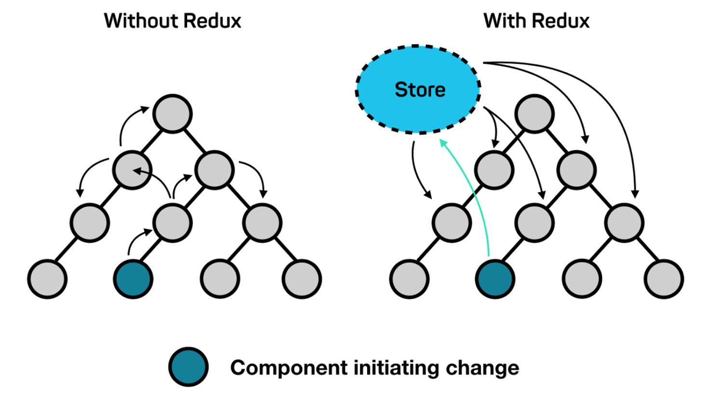

# What is Redux

> React에서 데이터는 한 방향으로만 흐른다. 즉 단방향 데이터 흐름을 가지고 있다. 자식 컴포넌트는 부모컴포넌트에게 props를 넘겨받아 데이터를 처리한다. 자식 컴포넌트 끼리의 데이터 교류는 없고, 항상 부모 컴포넌트를 거쳐가야 한다. 
>
> 이러한 트리 구조에서 depth가 작을때는 큰 문제가 없지만 프로그램이 복잡해질수록 문제는 커진다. 한 컴포넌트의 변화가 같은 레벨에 있는 컴포넌트에 영향을 주려면 부모 컴포넌트 까지 따라 올라갔다 내려와야한다.
>
> Redux는 이러한 복잡한 데이터의 흐름을 해결해준다. store에서 모든 데이터를 가지고 있고, 각각의 컴포넌트에서 데이터가 필요하면 부모 컴포넌트에서 내려주는것이 아니라 store에서 가지고 오는 형식으로 동작한다.

> Redux는 리액트와 합이 잘 맞지만 독립적인 라이브러리이므로, 리액트 없이 사용할 수 있다.