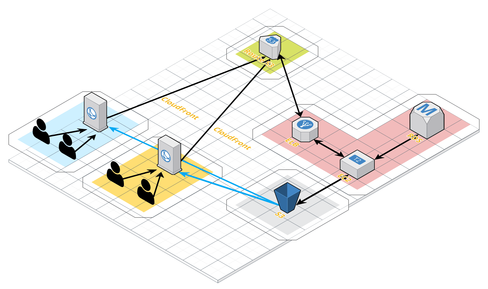

# Cloud Front

> Cloud Front 는 AWS에서 제공하는 CDN( Content Delivery Network ) 서비스이다. origin 서버가 클라이언트와 멀리 떨어져있으면 데이터를 빠르게 전달할 수 없다. 이를 해결하기 위해 CDN 서비스를 제공한다.
>
> -성능-
>
> CDN 서비스는 클라이언트에게 데이터를 효과적으로 전달하기 위해 Origin 서버에 위치한 원본 파일을 전세계에 위치한 노드 서버( Edge Location )에 배포하고 이 노드 서버가 근처에있는 클라이언트에게 파일을 제공하는 서비스이다.
>
> -보안-
>
> AWS S3를 이용하면 정적 웹 호스팅이 가능하지만, 웹 호스팅의 endpoint는 https를 지원하지 않는다. 하지만 Cloud Front를 사용하면 S3의 웹 호스팅 endpoint에서도 https를 사용할 수 있다.

