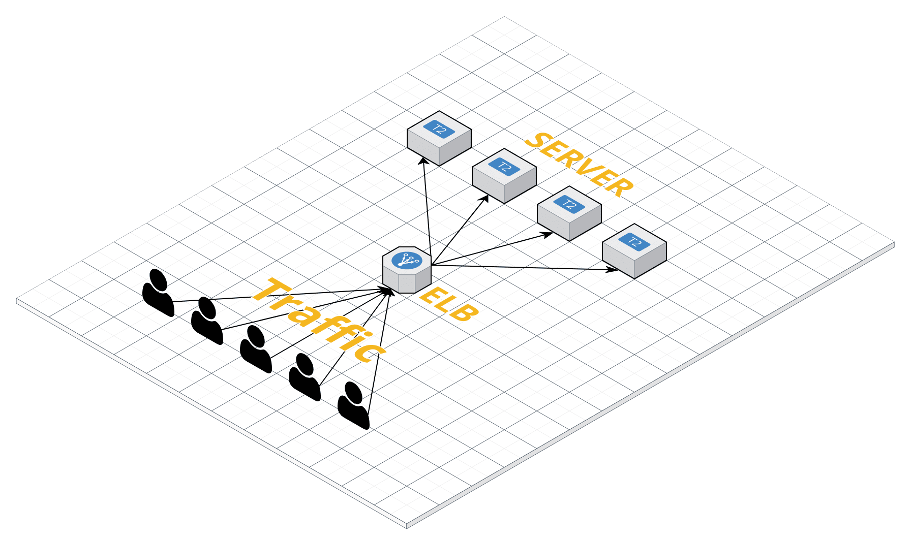

# ELB

> Elastic Load Balancing은 한 서비스가 여러대의 서버로 나눠져 있을때, 이 서로 다른 ip를 가진 서버를 하나의 통합된 ip로 접근할 수 있게해주는 서비스이다.

### Feature

- **트래픽 분산**

- **자동 확장**

  : 많은 트래픽이 발생할 경우 ELB하나로 모든 트래픽을 감당해야 한다. AWS에서는 ELB의 스케일을 자동으로 조절함으로써 이에 대응한다.

- **인스턴스의 상태를 자동으로 감지하여 오류가 있는 시스템은 배제**

  : 여러개의 서버중 오류가 있는 서버는 자동으로 배제시킨다.

- **사용자의 세션을 특정 인스턴스(서버)에 고정**

- **SSL 암호화 지원**

- **cloudwatch를 통해서 모니터링 지원**

