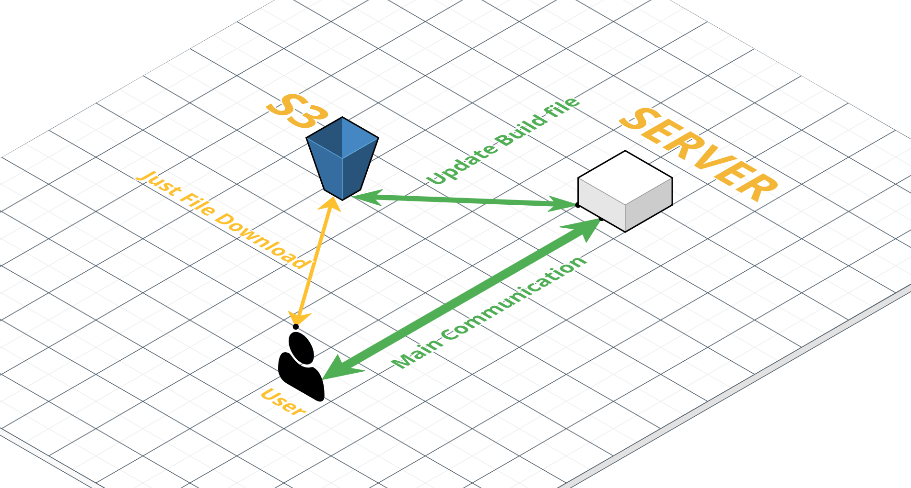

# S3

> Simple Storage Service의 약자로 파일서버의 역할을 하는 AWS 서비스이다. 
>
> S3는 앱스토어와 같은 역할이다. 만약 카카오톡 서버스를 이용한다고 할 때, 우리는 앱스토어를 통해 카카오톡 클라이언트 파일을 다운 받는다. 이후에 카카오톡 서비스를 이용할 때 우리는 앱스토어를 통해 카카오톡 서버와 통신하는것이 아니라 카카오톡 서버와 바로 통신한다.

