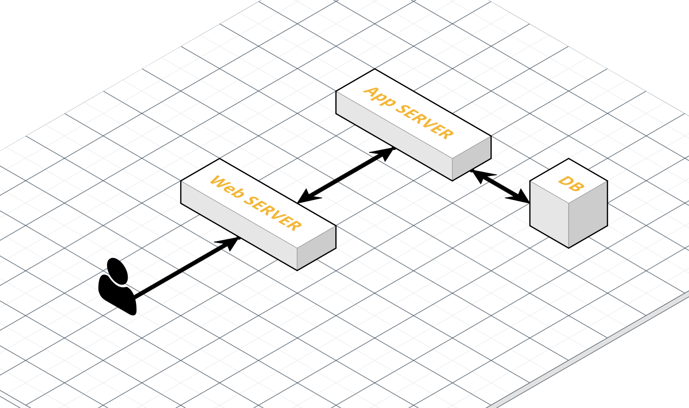

# S3

> Simple Storage Service의 약자로 파일서버의 역할을 하는 AWS 서비스이다.

### 파일 서버

> 보통 웹서버로 통합하여 사용하기도 하고, 웹서버에서 파일 서버를 분리해서 사용하기도 한다. 웹 서버는 파일을 제공하는 파일서버와 HTTP통신을 하는 HTTP서버로 구성되어 있다. 
>
> 웹 서버는 클라이언트의 요청에 따라 파일서버에서 파일을 제공하기도 하고, 필요한 경우 어플리케이션 서버에 클라이언트 요청을 전달하여 처리한 후, 받은 결과를 다시 클라이언트에게 제공한다.
>
> AWS의 S3는 웹서버를 이야기한다.

