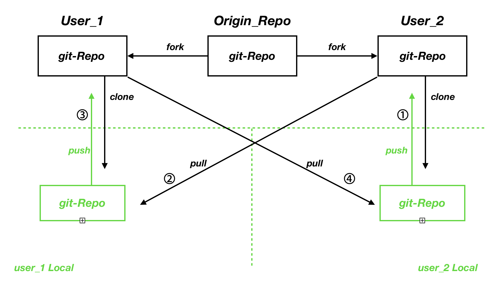

# Remote Flow

> 여러명이 함께 코드를 작성하는 경우 git의 remote를 이용하여 코드를 공유할 수 있다.


- 다른 저장소를 remote로 연결하기

  ```text
  $ git remote add [custom_name] [repo_address]
  ```

- 다른 저장소의 코드를 가져오기

  ```text
  $ git pull [custom_name] [branch_name]
  ```

- 각각의 저장소를 clone한 뒤에 ① ② ③ ④ 순서를 반복하면서 진행된다.

  


- remote 삭제하기

  ```javascript
  $ git remote rm [custom_name]
  ```

- 직전 log로 돌아가기 ( 직전 상태로 돌아가기 )

  ```text
  $ git reset --hard HEAD~1
  ```

  : `--hard` 옵션은 log와 실제 파일내용까지 모두 이전 상태로 돌아간다.

  : `--soft` 옵션은 실제 파일내용은 돌아가지않고 커밋할수 있는 상태로 돌아간다. 그리고 log는 지워진다.