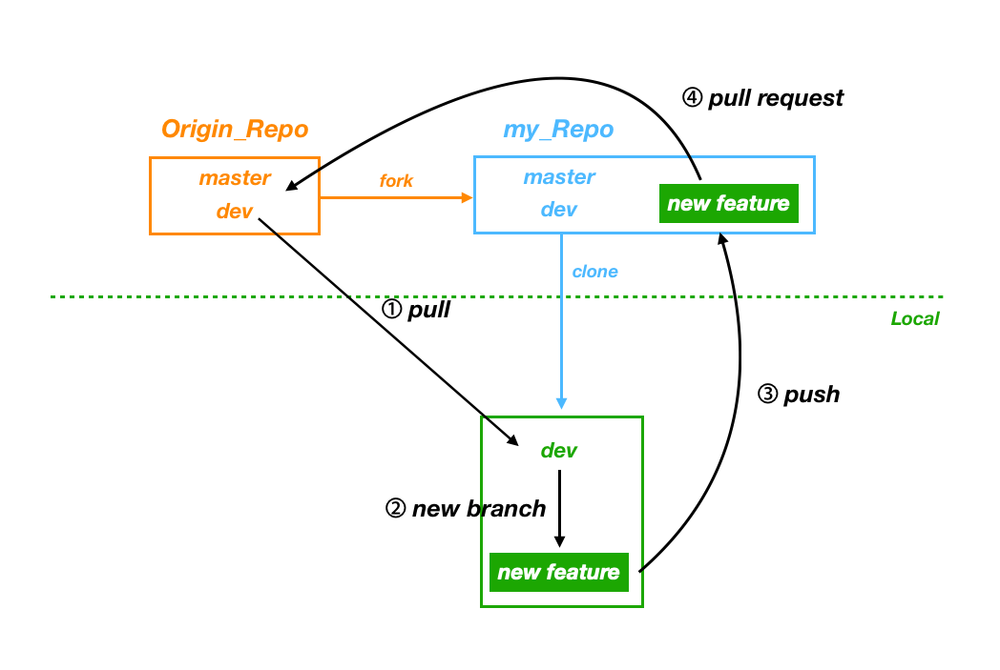

# Work Flow

> 일반적인 git workflow은 다음과 같다.

1. Origin repo를 fork하고 local로 clone후 remote로 연결

```bash
$ git remote add upstream <Origin_Repo dev branch>
```

2. Dev branch는 항상 최신 코드로 유지

``` bash
$ git pull upstream dev
```

3. Feature마다 branch를 생성하여 개발

```bash
$ git checkout -b <newFeature>
```

4. 개발한 branch를 fork 받아온 repo에 push

```bash
$ git push origin <newFeature>
```

5. push한 branch를 Origin_Repo에 Pull Request




